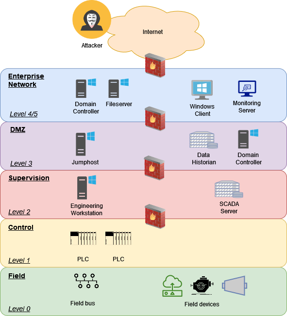

# StealthCup 2025: Evasion-Focused IDS Benchmarking

**StealthCup** is a novel evaluation framework that benchmarks Intrusion Detection Systems (IDS) under **realistic, adversarial conditions**.  
Instead of replaying synthetic datasets, StealthCup uses **evasion-focused Capture-the-Flag (CTF)** challenges executed by professional penetration testers on a validated IT/OT testbed.  

The project combines:
- Realistic, multi-stage attack chains (IT → OT pivoting, AD takeover, PLC manipulation).
- A fully automated, reproducible Infrastructure-as-Code setup (Terraform, Ansible, Packer).
- Comparative evaluation of open-source (Snort, Suricata, Wazuh) and commercial IDS solutions.
- Open datasets of alerts, PCAPs, logs, and structured attacker writeups.  

StealthCup complements traditional benchmarks by exposing where IDS configurations fail against stealthy adversaries.

## Key Documents
- [Event Rules of the Game (PDF)](docs/Event_Rules_of_the_Game.pdf) – CTF competition format and scoring.  
- [Attack Walkthrough (MD)](docs/Attack_Walkthrough.md) – Step-by-step multi-stage intrusion example (for others see the writeups)
- [Writeups](docs/Writeups)  
- [Attack Chains (MD)](docs/img/KillChain.drawio.pdf) – Overview of the implemented TTPs.  
- [Plumetech Story (PDF)](docs/Plumetech_Story.pdf) – Narrative background used during the event.  

### Scientific Application & Results
- [Evaluation CSV](docs/ScientificApplication/csv)
- [Comparison with Volt Typhoon TTPs (XLSX)](docs/ScientificApplication/Comparison_VoltTyphoon.xlsx)  
- [StealthCup Event Timeline (XLSX)](docs/ScientificApplication/StealthCup_Timeline.xlsx)  

### IDS Configuration & Detection
- [Wazuh Detection Blog - Detecting State of the Art Active Directory attacks](docs/Wazuh-Detections/Blog-WazuhDetections.md)  
- [Local Wazuh Rules](docs/Wazuh-Detections/local_rules.xml)  
- [Custom Suricata Rules](docs/Wazuh-Detections/suricata_custom.rules)  

## Infrastructure

The `provisioning/` directories contain Terraform, Ansible, and Packer configurations for deploying the full IT/OT environment.  
Scripts and utilities for redeployment, testing, and simulation can be found under `scripts/` and `testing/`. 



[Detailed Infrastructure](docs/img/Network_detail_aws.drawio.pdf)

### Setup
We will publish more informations on how to deploy the network soon. Meanwhile you are invited to send us a message if you have any questions: pentest.ait.ac.at.

## Publications

StealthCup is described in detail in our upcoming research papers:  
- StealthCup: Realistic, Multi-Stage, Evasion-Focused CTF for Benchmarking IDS, M. Kern, D. Steffan, F. Schuster, F. Skopik, M. Landauer, D. Allison, S. Freudenthaler, E. Weippl, arXiv preprint arXiv:2511.17761, 2025

```
@misc{kern2025stealthcuprealisticmultistageevasionfocused,
      title={StealthCup: Realistic, Multi-Stage, Evasion-Focused CTF for Benchmarking IDS}, 
      author={Manuel Kern and Dominik Steffan and Felix Schuster and Florian Skopik and Max Landauer and David Allison and Simon Freudenthaler and Edgar Weippl},
      year={2025},
      eprint={2511.17761},
      archivePrefix={arXiv},
      primaryClass={cs.CR},
      url={https://arxiv.org/abs/2511.17761}, 
}
```

## Related
- Dataset release (alerts, PCAPs, logs) – coming soon.  

### Disclaimer
StealthCup is a research framework. Some scripts, exploits, and configurations are provided for academic use only. Do not deploy outside controlled environments.